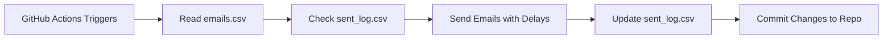

# 📧 Career Outreach Emailer System

[](https://opensource.org/licenses/MIT)
[](https://www.python.org/downloads/)
[](https://github.com/features/actions)
[](https://mail.google.com/)
[](https://github.com/yourusername/email-sender-automation/graphs/commit-activity)

> 🚀 **A fully automated email outreach system powered by GitHub Actions** - Send personalized emails and follow-ups automatically without any server!

## ✨ Features

- 📬 **Automated Daily Emails** - Send up to 125 emails per day automatically
- 🔄 **Smart Follow-ups** - Automatic follow-up emails to non-responders
- 🎲 **Randomized Content** - Multiple subject lines, opening lines, and signatures to avoid spam filters
- 📊 **Progress Tracking** - CSV-based tracking of sent emails and follow-ups
- ⏰ **Rate Limiting** - Intelligent delays between emails (50-120 seconds)
- 🎯 **Personalization** - Uses first names for personalized greetings
- 📎 **Attachment Support** - Automatically attaches your resume/document
- 🔒 **Secure** - Uses GitHub Secrets for credential management
- 🆓 **Zero Cost** - Runs entirely on GitHub Actions (free tier)

---

## 📋 Table of Contents

- [How It Works](#-how-it-works)
- [Getting Started](#-getting-started)
- [Step 1: Fork This Repository](#step-1-fork-this-repository)
- [Step 2: Prepare Your Email List](#step-2-prepare-your-email-list)
- [Step 3: Customize Email Content](#step-3-customize-email-content)
- [Step 4: Get Gmail App Password](#step-4-get-gmail-app-password)
- [Step 5: Configure GitHub Secrets](#step-5-configure-github-secrets)
- [Step 6: Enable GitHub Actions](#step-6-enable-github-actions)
- [Configuration Options](#-configuration-options)
- [Managing Responses](#-managing-responses)
- [Manual Workflow Execution](#-manual-workflow-execution)
- [Troubleshooting](#-troubleshooting)
- [FAQ](#-faq)

---

## 🔍 How It Works

This system uses **GitHub Actions** to automatically send emails on a schedule:

1. 📅 **Daily Email Campaign**: Runs automatically every day at 3:30 AM UTC
2. 📝 **Tracks Progress**: Maintains `sent_log.csv` to avoid duplicate emails
3. ✉️ **Sends Personalized Emails**: Uses templates with random variations
4. 🔄 **Follow-up System**: Sends follow-ups to non-responders (manual trigger)
5. 💾 **Auto-commits Changes**: Updates tracking files back to repository



---

## 🚀 Getting Started

### Prerequisites

- ✅ A Gmail account
- ✅ A GitHub account
- ✅ List of email addresses with recipient names

---

## Step 1: Fork This Repository

1. Click the **"Fork"** button at the top right of this page
2. This creates a copy of the repository in your GitHub account
3. You now have your own version to customize!


---

## Step 2: Prepare Your Email List

### 📄 Update `emails.csv`

This file contains all the recipients you want to send emails to.

**Format:**
```csv
email,first_name
john.doe@company.com,John
jane.smith@business.org,Jane
alex.wilson@startup.io,Alex
```

**Instructions:**

1. Open `emails.csv` in your forked repository
2. Click the ✏️ (Edit) button
3. Replace the existing data with your email list
4. **Important Format Rules:**
   - First row must be: `email,first_name`
   - Each subsequent row: `email_address,FirstName`
   - No spaces after commas
   - One recipient per line
5. Commit the changes

💡 **Tip**: You can add hundreds or thousands of emails - the script will automatically process them in batches!

---

## Step 3: Customize Email Content

### 📝 Editing `send_email.py`

Customize your outreach message by editing the following sections in `send_email.py`:

#### **A. Subject Lines** (Lines 28-37)

```python
SUBJECTS = [
    "Your Subject Line 1",
    "Your Subject Line 2",
    "Your Subject Line 3",
    "Your Subject Line 4",
    # Add more variations (recommended: 5-10 different subjects)
]
```

💡 **Best Practices:**
- Use 5-10 different subject line variations
- Keep them professional and relevant
- Avoid spammy words like "FREE", "ACT NOW", etc.
- Personalize based on your goal (job application, business proposal, etc.)

---

#### **B. Opening Lines** (Lines 39-50)

```python
OPENINGS = [
    "Hope you're doing well.",
    "Hope you're having a great day.",
    "I hope everything is going well on your end.",
    # Add more variations (recommended: 8-12 variations)
]
```

---

#### **C. Email Body** (Lines 66-88)

**Edit the `generate_email_body()` function:**

```python
def generate_email_body(first_name):
    opening = random.choice(OPENINGS)
    signature = random.choice(SIGNATURES)

    body = f"""
Hi {first_name},

{opening}

[YOUR MAIN MESSAGE HERE]

I'm reaching out because [YOUR REASON].

[YOUR PITCH/VALUE PROPOSITION]

[YOUR CALL TO ACTION]

{signature}
{LINKS}
"""
    return body
```

📝 **Customization Tips:**
- Replace `[YOUR MAIN MESSAGE HERE]` with your actual message
- Keep it concise (150-250 words recommended)
- Include a clear call-to-action
- Mention value proposition clearly

---

#### **D. Signatures** (Lines 52-59)

```python
SIGNATURES = [
    "Best regards,\nYour Name\n+1-234-567-8900",
    "Warm regards,\nYour Name\n+1-234-567-8900",
    "Sincerely,\nYour Name\n+1-234-567-8900",
    # Add 5-8 signature variations
]
```

---

#### **E. Links/Portfolio** (Line 61)

```python
LINKS = "\nhttps://yourwebsite.com\nhttps://linkedin.com/in/yourprofile"
```

---

#### **F. Resume/Attachment** (Line 63)

```python
ATTACHMENT_PATH = "resume.pdf"
```

**To change attachment:**
1. Upload your PDF file to the repository
2. Update `ATTACHMENT_PATH` with your filename
3. If you don't want attachments, comment out lines 100-103 in `send_email.py`

---

### 🔄 Customizing Follow-up Emails

Edit `send_followup.py` to customize follow-up messages:

- **Subject Options** (Lines 29-35)
- **Openers** (Lines 37-44)
- **Body Variants** (Lines 46-76)
- **Signatures** (Lines 78-103)

---

## Step 4: Get Gmail App Password

🔐 **Why App Password?** Gmail requires App Passwords for third-party apps (like this script) to send emails securely. You **cannot** use your regular Gmail password.

### 📱 Step-by-Step Instructions:

#### **Prerequisites:**
- ✅ 2-Step Verification must be enabled on your Google account

---

#### **Enable 2-Step Verification** (if not already enabled):

1. Go to your Google Account: https://myaccount.google.com/
2. Click **"Security"** in the left sidebar
3. Under **"How you sign in to Google"**, click **"2-Step Verification"**
4. Click **"Get Started"** and follow the setup wizard
5. Add your phone number and verify it

---

#### **Generate App Password:**

1. Visit: https://myaccount.google.com/apppasswords
   - OR: Google Account → Security → 2-Step Verification → App passwords

2. You might need to sign in again

3. **Select App**: Choose **"Mail"**

4. **Select Device**: Choose **"Other (Custom name)"**
   - Enter: `Email Automation` or any name you prefer

5. Click **"Generate"**

6. 🎉 **Google will show a 16-character password** like: `abcd efgh ijkl mnop`

7. **⚠️ IMPORTANT**: 
   - Copy this password immediately
   - Remove all spaces: `abcdefghijklmnop`
   - You won't be able to see it again!
   - Store it securely

---

#### **Visual Guide:**

```
Google Account > Security > 2-Step Verification > App Passwords
                                                        ↓
                                            Select app: Mail
                                            Select device: Other
                                                        ↓
                                            Click "Generate"
                                                        ↓
                                        Copy 16-letter password
                                        (Remove spaces!)
```

---

#### **Troubleshooting App Password:**

❌ **"App passwords" option not visible?**
- ✅ Make sure 2-Step Verification is enabled
- ✅ Wait 10-15 minutes after enabling 2-Step Verification
- ✅ Try accessing from: https://myaccount.google.com/apppasswords

❌ **Getting "Less secure app" errors?**
- ✅ You must use App Password, not your regular password
- ✅ Make sure 2-Step Verification is active

---

## Step 5: Configure GitHub Secrets

GitHub Secrets securely store your Gmail credentials.

### 🔐 Adding Secrets:

1. Go to your forked repository on GitHub
2. Click **"Settings"** tab (top menu)
3. In the left sidebar, click **"Secrets and variables"** → **"Actions"**
4. Click **"New repository secret"** button

---

### **Secret 1: EMAIL_ADDRESS**

- **Name**: `EMAIL_ADDRESS`
- **Value**: Your Gmail address (e.g., `yourname@gmail.com`)
- Click **"Add secret"**

---

### **Secret 2: EMAIL_PASSWORD**

- **Name**: `EMAIL_PASSWORD`
- **Value**: Your 16-character App Password (without spaces!)
  - Example: `abcdefghijklmnop`
- Click **"Add secret"**

---

### ✅ Verify Secrets:

You should now see two secrets listed:
- ✅ `EMAIL_ADDRESS`
- ✅ `EMAIL_PASSWORD`

🔒 **Security Note**: These secrets are encrypted and not visible after creation. They can only be used by GitHub Actions.

---

## Step 6: Enable GitHub Actions

By default, forked repositories have Actions disabled.

### 🎬 Enabling Actions:

1. Go to the **"Actions"** tab in your repository
2. Click **"I understand my workflows, go ahead and enable them"**
3. You should see two workflows:
   - 📧 **Send Daily Emails**
   - 🔄 **Send Follow-up Emails**

---

### 🚀 Test Your Setup (Recommended):

Before waiting for the scheduled run, test manually:

1. Go to **"Actions"** tab
2. Click on **"Send Daily Emails"** workflow (left sidebar)
3. Click **"Run workflow"** dropdown (right side)
4. Click the green **"Run workflow"** button
5. Monitor the execution in real-time

✅ **Success indicators:**
- Workflow shows green checkmark ✓
- `sent_log.csv` is updated with sent emails
- Recipients receive emails

❌ **If it fails:**
- Check the error logs in the workflow run
- Verify your secrets are correctly set
- See [Troubleshooting](#-troubleshooting) section

---

## ⚙️ Configuration Options

### 📊 Daily Email Limits

Edit these variables in `send_email.py`:

```python
LIMIT = 125              # Maximum emails per day (Line 24)
MIN_DELAY = 50           # Minimum delay in seconds (Line 25)
MAX_DELAY = 120          # Maximum delay in seconds (Line 26)
```

**Recommendations:**
- **Gmail Free Account**: Keep limit at 100-150 emails/day
- **Gmail Workspace**: Can go up to 500-2000/day
- **Delay**: 50-120 seconds avoids spam detection
- **Total Time**: 125 emails × 85 sec avg = ~3 hours runtime

⚠️ **Gmail Sending Limits:**
- Free Gmail: ~500 emails/day
- Google Workspace: ~2,000 emails/day
- Exceeding limits may temporarily suspend your account

---

### 🔄 Follow-up Email Configuration

Edit `send_followup.py`:

```python
FOLLOWUP_LIMIT = 40      # Max follow-ups per day (Line 25)
MIN_DELAY = 40           # Minimum delay in seconds (Line 26)
MAX_DELAY = 60           # Maximum delay in seconds (Line 27)
```

---

### ⏰ Schedule Configuration

The daily email workflow runs at **3:30 AM UTC** by default.

**To change the schedule:**

Edit `.github/workflows/send-emails.yml` (Line 5):

```yaml
schedule:
  - cron: "30 3 * * *"  # Format: "minute hour * * *"
```

**Example Schedules:**

| Schedule | Cron Expression | Description |
|----------|----------------|-------------|
| 8:00 AM UTC | `0 8 * * *` | Every day at 8 AM UTC |
| 2:30 PM UTC | `30 14 * * *` | Every day at 2:30 PM UTC |
| Every 12 hours | `0 */12 * * *` | Runs at 12 AM and 12 PM UTC |
| Weekdays only | `0 9 * * 1-5` | Monday-Friday at 9 AM UTC |

🌍 **Convert UTC to Your Timezone:**
- Use: https://www.worldtimebuddy.com/
- Example: 3:30 AM UTC = 9:00 AM IST

---

## 📬 Managing Responses

### 📝 Tracking Responses Manually

When someone replies to your email, you need to manually update `replied.csv` to prevent follow-ups.

#### **Creating/Updating `replied.csv`:**

1. If `replied.csv` doesn't exist, create it in your repository
2. Click **"Add file"** → **"Create new file"**
3. Name it: `replied.csv`
4. Add this header:
   ```csv
   email
   ```
5. Add responded email addresses (one per line):
   ```csv
   email
   john.doe@company.com
   jane.smith@business.org
   ```
6. Commit the file

---

### 🔄 How It Works:

- The `send_followup.py` script checks `replied.csv`
- Emails in this file will **NOT** receive follow-ups
- This prevents bothering people who already responded

---

### 📊 Tracking Status:

| File | Purpose | Updated By |
|------|---------|-----------|
| `emails.csv` | Master contact list | You (manual) |
| `sent_log.csv` | Tracks sent initial emails | Automated |
| `followup_sent.csv` | Tracks sent follow-ups | Automated |
| `replied.csv` | Tracks who replied | You (manual) |

---

### 🔍 Workflow:

```
emails.csv → send_email.py → sent_log.csv
                                   ↓
                              (Wait days)
                                   ↓
              (Check replied.csv for responses)
                                   ↓
              send_followup.py → followup_sent.csv
```

---

## 🎮 Manual Workflow Execution

### 📧 Manually Run Daily Emails:

1. Go to **"Actions"** tab
2. Select **"Send Daily Emails"** (left sidebar)
3. Click **"Run workflow"** button (right side)
4. Select branch (usually `main`)
5. Click green **"Run workflow"** button

**When to use:**
- Testing your setup
- Sending extra batches
- Resuming after fixing issues

---

### 🔄 Manually Run Follow-ups:

1. Go to **"Actions"** tab
2. Select **"Send Follow-up Emails"** (left sidebar)
3. Click **"Run workflow"** button
4. Select branch (usually `main`)
5. Click green **"Run workflow"** button

**When to use:**
- 3-7 days after initial emails
- Checking who hasn't responded
- Sending polite reminders

💡 **Tip**: Update `replied.csv` before running follow-ups!

---

### 📊 Monitoring Workflow Runs:

Click on any workflow run to see:
- ✅ **Status**: Success/Failure
- 📝 **Logs**: Detailed output
- ⏱️ **Duration**: How long it ran
- 📄 **Changed files**: What was updated

---

## 🔧 Troubleshooting

### ❌ Common Issues & Solutions:

#### **Issue 1: "Authentication failed" Error**

**Symptoms:**
```
smtplib.SMTPAuthenticationError: (535, b'5.7.8 Username and Password not accepted')
```

**Solutions:**
- ✅ Verify you're using **App Password**, not regular Gmail password
- ✅ Ensure App Password has no spaces
- ✅ Check `EMAIL_ADDRESS` secret is correct
- ✅ Regenerate App Password and update secret

---

#### **Issue 2: Workflow Not Running Automatically**

**Symptoms:**
- No automatic emails at scheduled time
- Workflow never triggers

**Solutions:**
- ✅ Enable GitHub Actions (see Step 6)
- ✅ Check if workflow file is in `.github/workflows/` folder
- ✅ Verify cron schedule is valid
- ✅ Ensure repository is not private (or has Actions enabled)

---

#### **Issue 3: "No Changes to Commit" Warning**

**Symptoms:**
```
nothing to commit, working tree clean
```

**This is normal!** Means:
- No new emails were sent (all already sent)
- Check if `emails.csv` has unsent emails

---

#### **Issue 4: CSV File Not Updating**

**Symptoms:**
- `sent_log.csv` not showing sent emails

**Solutions:**
- ✅ Check GitHub Actions permissions
- ✅ Verify workflow has `contents: write` permission
- ✅ Look at workflow logs for commit errors
- ✅ Ensure `sent_log.csv` exists in repository

---

#### **Issue 5: Emails Going to Spam**

**Symptoms:**
- Recipients not receiving emails
- Emails in spam folder

**Solutions:**
- ✅ Use varied subject lines (5-10 variations)
- ✅ Increase delays between emails (100-180 seconds)
- ✅ Keep email content natural (avoid spam words)
- ✅ Don't send too many emails per day (keep under 100)
- ✅ Add SPF and DKIM records to your domain (advanced)
- ✅ Warm up your email account (send manually first)

---

#### **Issue 6: Rate Limit Exceeded**

**Symptoms:**
```
SMTPSenderRefused: (421, b'4.7.0 Try again later')
```

**Solutions:**
- ✅ Reduce `LIMIT` in `send_email.py` (try 50-75/day)
- ✅ Increase delays (`MIN_DELAY = 100, MAX_DELAY = 180`)
- ✅ Wait 24 hours before trying again
- ✅ Consider using Gmail Workspace for higher limits

---

## ❓ FAQ

### **Q1: Is this free to use?**
✅ Yes! GitHub Actions provides 2,000 free minutes/month for public repositories.

### **Q2: Can I use other email providers (Yahoo, Outlook)?**
⚠️ The script is configured for Gmail. Other providers need SMTP configuration changes:
- Outlook: `smtp.office365.com`, port 587
- Yahoo: `smtp.mail.yahoo.com`, port 587

### **Q3: How many emails can I send per day?**
- **Gmail Free**: ~500 emails/day
- **Gmail Workspace**: ~2,000 emails/day
- Start with 100-125/day to avoid issues

### **Q4: Will this work with a private repository?**
✅ Yes, but GitHub Actions minutes are limited:
- Free plan: 2,000 minutes/month
- Pro plan: 3,000 minutes/month

### **Q5: Can I send to different email lists?**
✅ Yes! Just update `emails.csv` with your new list.

### **Q6: How do I stop the automation?**
Two options:
1. **Disable workflow**: Actions tab → Select workflow → "..." → Disable
2. **Delete workflow file**: Remove `.github/workflows/send-emails.yml`

### **Q7: Can I track open rates or click rates?**
❌ Not built-in. You would need:
- Email marketing tools (Mailchimp, SendGrid)
- Custom tracking pixels (advanced)
- Third-party analytics services

### **Q8: Is this against Gmail's terms of service?**
✅ Generally acceptable for reasonable personal outreach, but:
- ❌ Don't use for spam or unsolicited marketing
- ❌ Don't exceed rate limits
- ✅ Respect CAN-SPAM Act and GDPR regulations
- ✅ Provide unsubscribe options

### **Q9: Can I customize follow-up timing?**
✅ Yes! The follow-up workflow is manual, so you control when it runs. Best practices:
- Wait 3-5 days after initial email
- Maximum 1-2 follow-ups per recipient
- Update `replied.csv` before each follow-up

### **Q10: What if I want to reset everything?**
To start fresh:
1. Clear `sent_log.csv` (keep header row)
2. Clear `followup_sent.csv` (keep header row)
3. Clear `replied.csv` (keep header row)
4. Commit changes

---

## 📊 Project Structure

```
email-sender-automation/
│
├── .github/
│   └── workflows/
│       ├── send-emails.yml         # Daily email automation workflow
│       └── send_followups.yml      # Follow-up email workflow (manual)
│
├── send_email.py                   # Main email sending script
├── send_followup.py                # Follow-up email script
│
├── emails.csv                      # Master email list (YOUR DATA)
├── sent_log.csv                    # Tracks sent emails (auto-updated)
├── followup_sent.csv               # Tracks sent follow-ups (auto-updated)
├── replied.csv                     # Manual tracking of responses
│
├── resume.pdf                      # Your attachment (update with yours)
└── README.md                       # This file
```

---

## 🛡️ Security Best Practices

1. 🔐 **Never commit passwords**: Always use GitHub Secrets
2. 🚫 **Don't share App Passwords**: Treat them like regular passwords
3. ✅ **Use repository secrets**: Not environment secrets (more secure)
4. 🔄 **Rotate passwords periodically**: Change App Password every 3-6 months
5. 📊 **Monitor activity**: Check Gmail sent folder regularly
6. ⚠️ **Revoke unused App Passwords**: Clean up old passwords in Google Account settings

---

## 🙏 Support & Contribution

### Found a bug? 🐛
- Open an issue on GitHub

### Have a feature request? 💡
- Open an issue with the "enhancement" label

### Want to contribute? 🤝
1. Fork the repository
2. Create a feature branch
3. Make your changes
4. Submit a pull request

---

## 📜 License

This project is open source and available under the [MIT License](LICENSE).

---

## ⚠️ Disclaimer

**Use this tool responsibly:**
- 📋 Only send emails to people who expect to hear from you
- 🚫 Don't use for spam or unsolicited commercial emails
- ✅ Comply with CAN-SPAM Act, GDPR, and other email regulations
- 🤝 Respect recipient privacy and provide opt-out options
- ⚖️ You are responsible for how you use this tool

---

## 🌟 Show Your Support

If you found this project helpful:
- ⭐ **Star this repository**
- 🍴 **Fork it** and customize for your needs
- 📢 **Share** with others who might find it useful
- 🐛 **Report bugs** or **suggest improvements**

---

## 📞 Contact

Have questions? Need help?
- 📧 Open an issue on GitHub
- 💬 Check existing issues for solutions
- 📖 Read through this README carefully

---

<div align="center">

### 🚀 Ready to automate your outreach?

**[Fork This Repo](#step-1-fork-this-repository)** • **[Get Started](#-getting-started)** • **[Report Issues](https://github.com/yourusername/email-sender-automation/issues)**

---

**Made with ❤️ for efficient outreach campaigns**

*Last Updated: January 2025*

</div>
